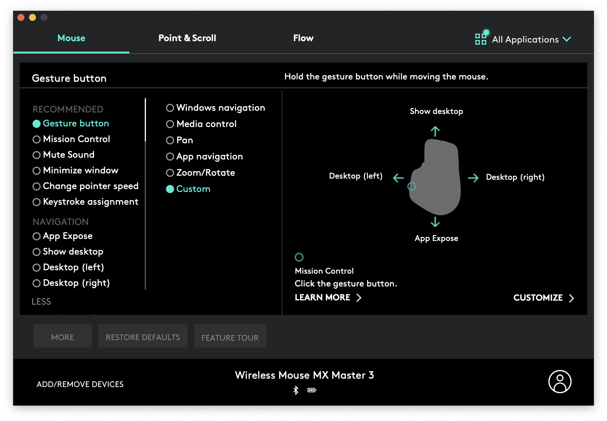

# setting up new mac
# install xcode
`xcode-select --install`

# [install rosetta](https://apple.stackexchange.com/questions/408375/zsh-bad-cpu-type-in-executable)
for M1 chips

`softwareupdate --install-rosetta`

# symlink files
`./setup.sh`

# set up github links

[create git ssh key](https://docs.github.com/en/authentication/connecting-to-github-with-ssh/generating-a-new-ssh-key-and-adding-it-to-the-ssh-agent)

`./setup.sh --github`

# [install homebrew](https://brew.sh)
## link the settings file
```sh
# this is to link the file
brew bundle --file=~/.dotfiles/Brewfile
# and run this to update it
brew bundle dump --force --describe --file=~/.dotfiles/Brewfile
```

## visual studio
 - run `defaults write com.microsoft.VSCode ApplePressAndHoldEnabled -bool false` for key repeat

## spotify
1. show advanced settings
1. say no to opening on login

## messenger
 - go to settings > disable launch on startup

## zoom
 - settings > share screen > window size ... > maintain current size

## steam
 - settings > user & groups > remove steam from startup

# download apps from appstore
- Scan Thing
- Daisy Disk
- Amphetamine
- Horo
- Good Notes

# enable 3 finger drag
`System Preferences > Accessibility > Pointer Control > Mouse & Trackpad > Trackpad Options > Enable Dragging > Three Finger Drag`

# iTerm2 Settings
```sh
defaults write com.googlecode.iterm2 LoadPrefsFromCustomFolder -bool true
defaults write com.googlecode.iterm2 PrefsCustomFolder -string "$HOME/.dotfiles/iterm2"
defaults write com.googlecode.iterm2 NoSyncNeverRemindPrefsChangesLostForFile -bool true
```

# [install logi options](https://www.logitech.com/en-us/product/options)

## set up the guesture button


# set up key board repeat
`Keyboard > Keyboard > Key Repeat`

**set fast**

`Keyboard > Keyboard > Delay Until Repeat`

**set short**

# update finder settings
`Finder > Preferences > [do stuff here]`

`Finder > View > Show Path Bar`

`Finder > View > Show Status Bar`

# [miniconda](https://docs.conda.io/en/latest/miniconda.html)
> installed with homebrew
- [jupyter lab](https://jupyter.org/install)
- ipython

# enable document sync on icloud
`System Preferences > Apple ID > iCloud Drive > Options > Desktop & Documents Folders`

# disable icloud optimization
`System Preferences > Apple ID > iCloud and disable Optimize Mac Storage`

# misc settings
1. enable icloud on messages
1. enable control zoom
1. enable tts
1. put bluetooth in menu bar
1. put sound in menu bar
1. play feedback when volume is changed

# set up gitlocal
```git
# ~/.gitlocal on mac
[credential]
    helper = osxkeychain
```

# Quicklook
- use Brew to install the quicklook plugins into `~/Library/QuickLook`

## [ql color code on m1 fix](https://github.com/jpc/QLColorCode/releases/tag/release-4.1.2%2Bm1)

## ql stephen fix
```bash
xattr -Cr ~/Library/QuickLook/QLStephen.qlgenerator
qlmanage -r
qlmanage -r cache
killall Finder
```

## [ipynb quicklook](https://github.com/tuxu/ipynb-quicklook/releases)
1. unzip
1. move to `/Library/QuickLook`

```bash
qlmanage -r
killall Finder
```

# firewall

[This one is a bit controversial. If you do not install software which allows network access of any kind, skip it. If you run potentially vulnerable software you don't want to be accessed from other machines, consider turning the built-in firewall on. This particularly applies if you develop network software.](https://sourabhbajaj.com/mac-setup/Security/)

1. Choose Apple menu () > System Preferences, then click Security & Privacy.
1. Click the Firewall tab.
1. Click the Lock button, then enter an administrator name and password.
1. Click Turn On Firewall.
1. Click Firewall Options.
1. Uncheck `Automatically allow signed software to receive incoming connections`.

The last step disables automatic access for software from the App Store. From now on you can either add (dis)allowed programs to the list within the Firewall Options or just click on Allow\/Deny, if you get a popup asking you if a specific software may be accessed.

# TODO
## minor

## setup.sh
 - [ ] add auto generation of gitlocal based on the machine

### documentation
 - [ ] add hyperlinks to notes
 - [ ] clean up notes

### package managers
- [ ] add info about `brew`, `conda`, and other package managerso
    - add commands about like clean, doctor, help

### terminal
- [ ] [colorized man pages](https://superuser.com/questions/452034/bash-colorized-man-page)

### bash
- [ ] add better tab completion in bash
- [ ] add right hand side of prompt

### vim
- [ ] fix search in vim to fuzzy search
- [ ] read this [thing](https://vi.stackexchange.com/questions/12806/configure-which-column-gq-wraps-at)

### zsh
- [ ] look into greyed out tab completion in zsh
- [ ] look into vi mode for zsh ( add visual indicator for insert and command mode )
- [ ] https://stackoverflow.com/questions/13762280/zsh-compinit-insecure-directories

## quicklook
- [ ] look at the json quicklook and make it open wider

## major
- [ ] [dotbot](https://www.elliotdenolf.com/posts/bootstrap-your-dotfiles-with-dotbot)
- [ ] clean up documentation
